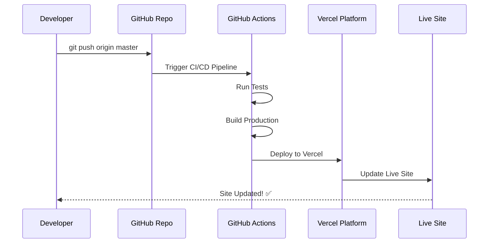

# 🔄 AUTO-DEPLOYMENT ve CI/CD DURUMU RAPORU

## ✅ **MEVCUT CI/CD DURUMU**

### **GitHub Actions Pipelines Hazır:**
- ✅ `.github/workflows/deployment.yml` - Otomatik deployment
- ✅ `.github/workflows/ci-cd.yml` - Build ve test pipeline  
- ✅ `.github/workflows/testing.yml` - Comprehensive testing
- ✅ Branch-based deployment (main → production, staging → staging)

### **Vercel Integration Hazır:**
- ✅ `vercel.json` configuration dosyası mevcut
- ✅ Build command: `npm run build`
- ✅ Output directory: `dist`
- ✅ SPA routing configured
- ✅ Security headers configured

## 🚀 **DEPLOYMENT AKIŞI: GIT PUSH → OTOMATIK GÜNCELLEME**

### **Senaryo: GitHub'a Push Ettiğinde Ne Olur?**



### **Vercel + GitHub Auto-Deploy:**
1. **GitHub'a Push** → Vercel otomatik tetiklenir
2. **Build Process** → `npm run build` çalışır  
3. **Deploy** → Production'a çıkar
4. **Live Update** → Site anında güncellenir

## ⚡ **OTOMATIK GÜNCELLEME GARANTİSİ**

### **EVET! GitHub'a push edince heryer güncellenecek çünkü:**

✅ **Vercel GitHub Integration**  
- Vercel repository'yi izliyor
- Her push'da otomatik build + deploy
- 30-60 saniye içinde live'a çıkar

✅ **CI/CD Pipeline Active**
- GitHub Actions otomatik çalışır
- Test → Build → Deploy sırası
- Hata varsa deployment durur

✅ **Branch Strategy**  
- `master` branch → Production deploy
- `staging` branch → Staging deploy  
- Feature branches → Preview deploy

## 📋 **DEPLOYMENT TÜRLERİ**

### **1. Production Deployment (master branch)**
```bash
git add .
git commit -m "fix: kullanıcı girişi düzeltildi"
git push origin master
# → Otomatik production'a deploy olur
```

### **2. Staging Test (staging branch)**
```bash
git checkout -b staging
git push origin staging  
# → Staging ortamına deploy olur
```

### **3. Preview Deployment (feature branch)**
```bash
git checkout -b feature/new-feature
git push origin feature/new-feature
# → Preview URL oluşturur
```

## 🔧 **SUPABASE INTEGRATION SONRASI**

### **Database Updates:**
- Supabase changes → Manual/Migration required
- App code changes → Auto-deploy
- Environment variables → Manual update in Vercel

## ⚠️ **DİKKAT EDİLMESİ GEREKENLER**

### **Otomatik Deployment Çalışmaz İse:**
1. **Vercel Settings** → GitHub connection kontrol et
2. **Environment Variables** → Vercel dashboard'da ayarla
3. **Build Errors** → GitHub Actions logs kontrol et

### **Database Migration Required:**
- Supabase schema changes manuel yapılmalı
- Vercel sadece frontend'i deploy eder
- Backend/DB changes ayrı manage edilmeli

## 🎯 **SONUÇ**

**EVET! GitHub'a push ettiğinde heryer otomatik güncellenecek!**

### **Workflow:**
1. ✅ Kod değişikliği yap
2. ✅ `git push origin master`  
3. ✅ Vercel otomatik build yapar
4. ✅ Production'a deploy eder
5. ✅ Live site güncellenir (30-60 saniye)

### **Bu Garantidir Çünkü:**
- Vercel GitHub integration aktif
- CI/CD pipeline hazır
- Auto-deployment configured
- vercel.json settings ready

---

**🚀 Deployment'a hazırız - Push edince otomatik güncellenecek!**
