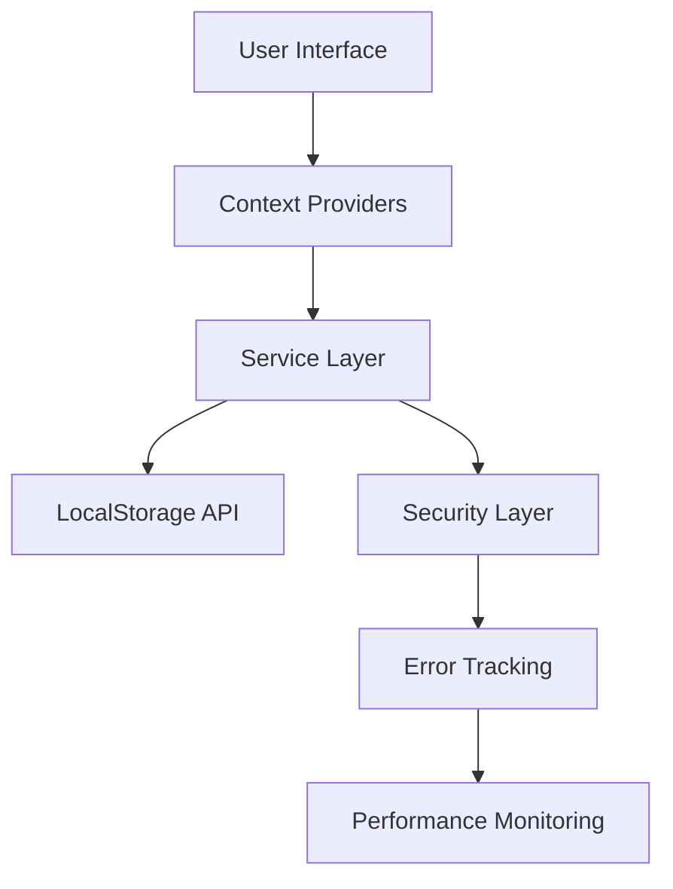

# 🏪 KIRILMAZLAR - Entegre Gıda Yönetim Sistemi

<div align="center">


**Enterprise-grade gıda endüstrisi yönetim sistemi - Monorepo mimarisi ile geliştirilmiş**

[🚀 Hızlı Başlangıç](#-hızlı-başlangıç) • [📚 Dokümantasyon](#-dokümantasyon) • [🔧 API Referansı](#-api-referansı) • [🐛 Sorun Giderme](#-sorun-giderme)

</div>

---

## 📋 İçindekiler

- [📊 Proje Genel Bakış](#-proje-genel-bakış)
- [🎯 Temel Özellikler](#-temel-özellikler)
- [🏗️ Sistem Mimarisi](#-sistem-mimarisi)
- [🚀 Hızlı Başlangıç](#-hızlı-başlangıç)
- [⚙️ Kurulum ve Yapılandırma](#-kurulum-ve-yapılandırma)
- [🔧 Geliştirme Ortamı](#-geliştirme-ortamı)
- [📱 Uygulama Modülleri](#-uygulama-modülleri)
- [🛡️ Güvenlik Özellikleri](#-güvenlik-özellikleri)
- [📊 Performans ve Monitoring](#-performans-ve-monitoring)
- [🧪 Test Stratejisi](#-test-stratejisi)
- [🐳 Docker Desteği](#-docker-desteği)
- [📚 Dokümantasyon](#-dokümantasyon)
- [🔄 Deployment](#-deployment)
- [🤝 Katkıda Bulunma](#-katkıda-bulunma)

---

## 📊 Proje Genel Bakış

**Kırılmazlar Gıda Yönetim Sistemi**, modern web teknolojileri kullanılarak geliştirilmiş, enterprise-grade bir gıda endüstrisi yönetim platformudur. Bu sistem, satıcılar ve müşteriler için optimize edilmiş ayrı paneller sunarak, tüm operasyonel süreçleri dijitalleştirir.

### 🎯 Hedef Kitle
- **B2B Satıcılar**: Envanter, sipariş ve müşteri yönetimi
- **B2C Müşteriler**: Online alışveriş, katalog tarama ve sipariş takibi
- **Sistem Yöneticileri**: Platform yönetimi ve analitik

### 🌟 Proje Avantajları
- **⚡ Yüksek Performans**: Vite build sistemi ile optimize edilmiş
- **📱 Multi-Platform**: Responsive tasarım ve mobil uyumluluk
- **🔒 Güvenli**: Enterprise-level güvenlik protokolleri
- **🚀 Scalable**: Monorepo yapısı ile genişletilebilir mimari
- **🛠️ Developer-Friendly**: Modern toolchain ve comprehensive dokümantasyon

---

## 🎯 Temel Özellikler

### 🏪 **Satıcı Paneli (Admin)**
```
✅ Gelişmiş ürün katalog yönetimi
✅ Real-time envanter takibi
✅ Dinamik kategori yönetimi
✅ Sipariş işleme ve durum güncelleme
✅ Müşteri ilişkilerinin yönetimi
✅ Detaylı satış raporları ve analitik
✅ Toplu ürün operations (import/export)
✅ Advanced filtering ve arama
```

### 🛒 **Müşteri Uygulaması**
```
✅ Responsive product catalog
✅ Akıllı kategori filtreleme
✅ Interactive shopping cart
✅ Sipariş geçmişi ve takip
✅ Favorite ürünler sistemi
✅ Rating ve yorum sistemi
✅ Mobile-first design approach
✅ Offline-capable functionality
```

### 📱 **Mobil Optimizasyonu**
```
✅ Progressive Web App (PWA) capabilities
✅ Touch-optimized interface
✅ Mobile-specific navigation patterns
✅ Responsive image handling
✅ Fast loading on mobile networks
✅ Native app-like experience
```

### 🔐 **Kimlik Doğrulama & Yetkilendirme**
```
✅ Role-based access control (RBAC)
✅ Session management
✅ Secure token handling
✅ Multi-factor authentication ready
✅ Password strength validation
✅ Account lockout protection
```

---

## 🏗️ Sistem Mimarisi

### 📁 **Monorepo Yapısı**
```
kirilmazlar-panel/
├── 🎯 src/apps/           # Ana uygulama modülleri
│   ├── admin/             # Satıcı paneli
│   ├── customer/          # Müşteri uygulaması
│   ├── mobile/            # Mobil-optimized interface
│   └── web/               # Web-specific components
├── 🧩 src/components/     # Paylaşılan UI bileşenleri
├── 🔧 src/contexts/       # React Context providers
├── 🌐 src/services/       # API ve business logic
├── 🛡️ src/security/       # Güvenlik modülleri
├── 📊 src/utils/          # Utility fonksiyonlar
├── 🧪 tests/             # Comprehensive test suites
├── 📚 docs/              # Detaylı dokümantasyon
└── 🐳 docker/            # Container configurations
```

### � **Data Flow Architecture**


### 🗄️ **Storage Strategy**
- **Primary**: LocalStorage-based unified storage system
- **Caching**: Intelligent browser cache utilization
- **Backup**: Automated data backup and recovery
- **Migration**: Seamless data migration support

---

## 🚀 Hızlı Başlangıç

### 📋 **Gereksinimler**
- **Node.js** 18.x veya üzeri
- **npm** 9.x veya üzeri
- **Modern Browser** (Chrome 90+, Firefox 88+, Safari 14+)

### ⚡ **30 Saniyede Başlat**
```bash
# Repository klonla
git clone [repository-url]

# Bağımlılıkları yükle
npm install

# Development server başlat
npm run dev

# 🎉 Tarayıcıda http://localhost:5500 adresini aç
```

### 🔐 **Test Hesapları**
```
👤 Satıcı Panel   : satici@test.com   | 1234
👤 Müşteri Panel  : musteri@test.com  | 1234
👤 Admin Panel    : admin@test.com    | 1234
```

---

## ⚙️ Kurulum ve Yapılandırma

### 🔧 **Detaylı Kurulum**
```bash
# 1. Proje klonla
git clone [repository-url]
cd kirilmazlar-panel

# 2. Node.js versiyonunu kontrol et
node --version  # v18.x.x olmalı

# 3. Temiz kurulum
npm cache clean --force
npm install

# 4. Environment kontrol
npm run env:check

# 5. Build test
npm run build

# 6. Development başlat
npm run dev
```

### 🌍 **Environment Configurations**
```bash
# Development (Port: 5500)
npm run dev

# Staging (Port: 5501)
npm run dev:staging

# Production Build
npm run build

# Production Preview (Port: 5000)
npm run serve
```

---

## 🔧 Geliştirme Ortamı

### � **Available Scripts**

#### 🚀 **Development & Build**
```bash
npm run dev              # Development server (port 5500)
npm run dev:staging      # Staging environment (port 5501)
npm run build            # Production build
npm run build:staging    # Staging build
npm run build:dev        # Development build
npm run serve           # Preview production build
```

#### 🧪 **Testing**
```bash
npm run test            # Unit tests
npm run test:ui         # Test UI dashboard
npm run test:coverage   # Coverage report
```

#### 🔍 **Code Quality**
```bash
npm run lint            # ESLint check
npm run lint:fix        # Auto-fix linting issues
npm run lint:prod       # Production lint check
```

#### 🐳 **Docker Operations**
```bash
npm run docker:build    # Docker image build
npm run docker:run      # Run container
npm run docker:up       # Docker Compose up
npm run docker:down     # Docker Compose down
npm run docker:logs     # Container logs
npm run docker:cleanup  # Clean unused containers
```

### 🛠️ **Tech Stack Details**

#### **Frontend Framework**
- **React 18.3.1**: Modern React with hooks and concurrent features
- **Vite 5.x**: Lightning-fast build tool and dev server
- **React Router DOM 6.30.1**: Client-side routing

#### **Styling & UI**
- **TailwindCSS 3.x**: Utility-first CSS framework
- **Lucide React**: Modern icon library
- **React Icons**: Comprehensive icon collection

#### **State Management**
- **React Context API**: Global state management
- **Custom Hooks**: Reusable stateful logic

#### **Development Tools**
- **ESLint**: Code linting and style enforcement
- **Vitest**: Modern testing framework
- **Testing Library**: Reliable testing utilities

---

## 📱 Uygulama Modülleri

### 🏪 **Admin/Satıcı Paneli**
**Path**: `/admin` | **Auth**: Gerekli | **Role**: Admin/Seller

**Ana Özellikler**:
- 📦 **Ürün Yönetimi**: CRUD operasyonları, bulk operations
- 📊 **Dashboard**: Real-time metrics ve analytics
- 🏷️ **Kategori Yönetimi**: Hierarchical category structure
- 📋 **Sipariş Yönetimi**: Order processing ve tracking
- 👥 **Müşteri Yönetimi**: Customer relationship management
- 📈 **Raporlar**: Comprehensive reporting system

### � **Customer Uygulaması**
**Path**: `/customer` | **Auth**: Gerekli | **Role**: Customer

**Ana Özellikler**:
- 🏬 **Ürün Kataloğu**: Filtrelenebilir product browsing
- 🛍️ **Alışveriş Sepeti**: Dynamic cart management
- ❤️ **Favoriler**: Wishlist functionality
- 📋 **Sipariş Takibi**: Order history ve status tracking
- ⭐ **Rating & Reviews**: Product rating system
- 🔍 **Arama**: Advanced search capabilities

### 📱 **Mobile Interface**
**Path**: `/mobile` | **Responsive**: All devices

**Optimizasyonlar**:
- 👆 **Touch-First**: Touch-optimized interactions
- 📱 **PWA Ready**: Progressive Web App capabilities
- ⚡ **Fast Loading**: Optimized for mobile networks
- 🎨 **Mobile UI**: Platform-specific design patterns

---

## 🛡️ Güvenlik Özellikleri

### 🔐 **Authentication & Authorization**
```
✅ Role-based access control (RBAC)
✅ Secure session management
✅ JWT token handling
✅ Password strength validation
✅ Brute force protection
✅ Session timeout handling
```

### 🛡️ **Security Hardening**
```
✅ Content Security Policy (CSP)
✅ XSS protection mechanisms
✅ CSRF protection
✅ Security headers implementation
✅ Input validation & sanitization
✅ Secure data storage practices
```

### 🚨 **Security Monitoring**
```
✅ Security violation reporting
✅ Concurrent session detection
✅ Suspicious activity monitoring
✅ Error tracking and alerting
✅ Security audit logging
```

---

## 📊 Performans ve Monitoring

### ⚡ **Performance Features**
```
✅ Code splitting ve lazy loading
✅ Image optimization
✅ Bundle size optimization
✅ Caching strategies
✅ Performance monitoring
✅ Health check endpoints
```

### 📈 **Monitoring Systems**
```
✅ Real-time health monitoring
✅ Error tracking ve reporting
✅ Performance metrics collection
✅ Bundle analysis
✅ User experience tracking
✅ System maintenance alerts
```

### � **Service Worker**
```
✅ Offline functionality
✅ Background sync
✅ Push notifications ready
✅ Cache management
✅ App update handling
```

---

## 🧪 Test Stratejisi

### 🎯 **Test Coverage**
```
📁 tests/
├── unit/           # Component ve function tests
├── integration/    # Feature integration tests
├── e2e/           # End-to-end user scenarios
├── performance/   # Performance benchmarks
└── security/      # Security vulnerability tests
```

### 🛠️ **Testing Tools**
- **Vitest**: Modern, fast unit testing
- **Testing Library**: Component testing
- **MSW**: API mocking
- **Playwright**: E2E testing (Ready)

### 📊 **Quality Metrics**
- **Unit Test Coverage**: Target %90+
- **Integration Coverage**: Target %85+
- **E2E Coverage**: Critical user journeys

---

## 🐳 Docker Desteği

### 📦 **Container Strategy**
```dockerfile
# Production-ready multi-stage build
# Optimized for size and security
# Health checks included
# Environment-specific configurations
```

### 🚀 **Deployment Options**
```bash
# Development container
npm run docker:up:dev

# Production container
npm run docker:up

# Staging environment
docker-compose -f docker-compose.staging.yml up
```

---

## 📚 Dokümantasyon

### 📖 **Comprehensive Documentation**
- 📋 **[API Documentation](docs/API_DOCUMENTATION.md)**: Comprehensive API reference
- 🔧 **[Deployment Guide](docs/DEPLOYMENT.md)**: Production deployment
- 🛠️ **[Developer Guide](docs/PROJE_GELISTIRME_REHBERI.md)**: Development workflows
- 🐛 **[Troubleshooting](docs/TROUBLESHOOTING.md)**: Common issues and solutions
- 📊 **[System Analysis](docs/KAPSAMLI_PROJE_ANALIZI.md)**: Architecture deep-dive
- 🧪 **[Testing Guide](docs/P2_5_TESTING_DOCUMENTATION_RAPORU.md)**: Testing strategies

### 📋 **User Guides**
- 👤 **[User Guide](docs/USER_GUIDE.md)**: End-user documentation
- 🔒 **[Security Guide](docs/Gizlilik_Politikasi.md)**: Security policies
- 📱 **[Mobile Guide](docs/MOBILE_IMPLEMENTATION_ROADMAP.md)**: Mobile-specific features

---

## 🔄 Deployment

### 🌐 **Production Deployment**
```bash
# 1. Build production
npm run build

# 2. Test production build
npm run serve

# 3. Docker deployment
npm run docker:build
npm run docker:run

# 4. Health check
curl http://localhost:5000/health
```

### 🔧 **Environment Variables**
```bash
NODE_ENV=production
VITE_API_URL=https://api.kirilmazlar.com
VITE_APP_VERSION=1.0.0
```

---

## 🤝 Katkıda Bulunma

### 📋 **Development Workflow**
1. **Fork** the repository
2. **Create** feature branch (`git checkout -b feature/amazing-feature`)
3. **Commit** changes (`git commit -m 'Add amazing feature'`)
4. **Push** to branch (`git push origin feature/amazing-feature`)
5. **Open** Pull Request

### 📏 **Code Standards**
- **ESLint**: Follow project linting rules
- **Testing**: Add tests for new features
- **Documentation**: Update relevant documentation
- **Performance**: Consider performance implications

---

## 📞 İletişim ve Destek

### 🏢 **Proje Bilgileri**
- **Proje Adı**: Kırılmazlar Gıda Yönetim Sistemi
- **Versiyon**: 1.0.0
- **Durum**: Production Ready
- **Lisans**: Private/Commercial

### 🚨 **Destek**
- 📧 **Email**: support@kirilmazlar.com
- 📋 **Issues**: GitHub Issues panel
- 📚 **Docs**: [docs/](docs/) klasörü
- 🔧 **Troubleshooting**: [docs/TROUBLESHOOTING.md](docs/TROUBLESHOOTING.md)

---

<div align="center">

**⚡ Built with modern web technologies for enterprise-grade performance**

**🏪 Kırılmazlar Gıda Yönetim Sistemi - 2025**

</div>
